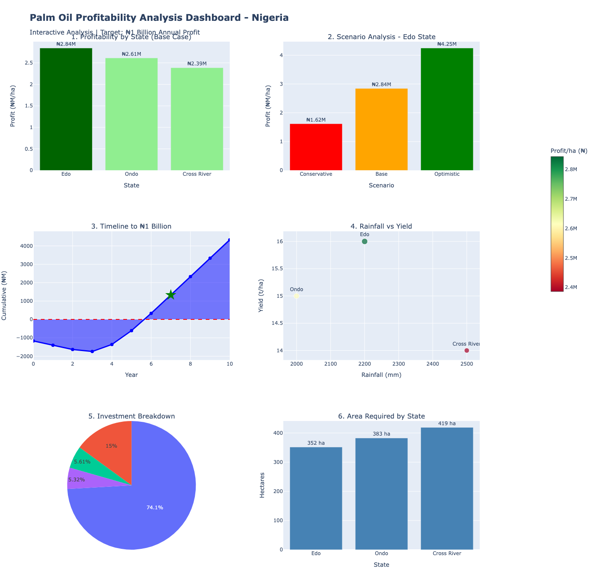

# 🌴 Palm Oil Investment Feasibility Analysis — Nigeria

> **Can a palm oil plantation generate ₦1 Billion in annual profit? Where, at what scale, and at what cost?**  
> This project answers those questions with data.

---

## 📌 Project Overview

This end-to-end data analysis project evaluates the feasibility of a large-scale palm oil plantation investment in Nigeria, targeting **₦1 Billion in annual profit**. The analysis covers geographic selection, financial modeling, scenario testing, and investment planning across three major palm oil-producing states.

**Prepared for:** Nigerian-German Investor  
**Date:** November 2025  
**Analyst:** IJ Data

---

## 🏆 Key Finding

> **Invest in Edo State** — 352 hectares | ₦940M total investment | 109% annual ROI | ₦1B profit achieved by Year 7

---

## 📁 Repository Structure

```
palm-oil-feasibility-nigeria/
│
├── 📓 notebooks/
│   └── palm_oil_analysis.ipynb         
│
├── 📊 data/
│   ├── raw/
│   │   └── raw_data.csv                 
│   └── clean/
│       └── clean_data.csv               
│
├── 📈 dashboard/
│   └── Palmoil_Profitability_Analysis_Dashboard.png   
├── 📄 report/
│   └── PALM_OIL_INVESTMENT_FEASIBILITY_ANALYSIS.pdf   
│
└── README.md
```

---

## 📊 Dashboard Preview




*6-panel interactive dashboard covering: state profitability, scenario analysis, investment timeline, rainfall vs yield correlation, investment breakdown, and area requirements.*

---

## 🗺️ Geographic Scope

Three states representing **34% of Nigeria's palm oil production** were analysed:

| State | National Production Share | Data Quality |
|-------|--------------------------|--------------|
| **Edo** | 12% | ✅ High — Actual (Okomu Oil Palm PLC) |
| Cross River | 11% | 🟡 Medium — Proxy estimate |
| Ondo | 11% | 🟡 Medium — Proxy estimate |

---

## 💰 Profitability Snapshot (Base Case)

| State | Profit/ha | Land Needed | Total Investment | ROI |
|-------|-----------|-------------|-----------------|-----|
| 🥇 **Edo** | ₦2.84M | 352 ha | ₦940M | 109% |
| 🥈 Ondo | ₦2.61M | 383 ha | ₦975M | 103% |
| 🥉 Cross River | ₦2.39M | 419 ha | ₦1.03B | 97% |

---

## ⏱️ Timeline to ₦1 Billion

| Phase | Years | Milestone |
|-------|-------|-----------|
| Establishment | 0–3 | No revenue; -₦940M invested |
| First Harvest | 4 | 50% capacity; ₦475M annual profit |
| Break-Even | 5 | Cumulative cash flow turns positive |
| Near Maturity | 6 | 95% capacity; ₦955M annual profit |
| **Target Achieved** | **7+** | **₦1B+ annual profit, 20+ year horizon** |

---

## 🧮 Profitability Model (Simplified)

```
FFB Yield (Edo): 16 t/ha
CPO Extraction Rate: 20%  →  CPO Yield = 3.2 t/ha
CPO Price: ₦1,100,000/t  →  Revenue = ₦3,520,000/ha

Operating Cost: ₦660,000/ha
Land Cost (amortised): ₦16,000/ha
Total Cost: ₦676,000/ha

Net Profit/ha = ₦3,520,000 - ₦676,000 = ₦2,844,000

Area for ₦1B target = ₦1,000,000,000 ÷ ₦2,844,000 = 352 hectares
ROI = (₦1B ÷ ₦940M) × 100 = 108.7%
```

---

## 🧰 Tools & Methods

| Category | Tools Used |
|----------|-----------|
| Data Processing | Python, pandas, Jupyter Notebook |
| Financial Modelling | Discounted cash flow, Monte Carlo simulation |
| Visualisation | Plotly (interactive), Matplotlib, Seaborn |
| Data Organization | Google Sheets |
| Scenario Testing | 9 scenarios across 3 states (±20% parameter variation) |
| Data Validation | 14+ sources, cross-referenced with industry benchmarks |

---

## 📚 Key Data Sources

- **Okomu Oil Palm PLC** (2024 Annual Report) — Audited by PricewaterhouseCoopers; primary data source for Edo State yields and financials
- **FAO FAOSTAT** — National palm oil production statistics
- **World Bank Climate Portal** — State-level rainfall data
- **Nigeria Property Centre** — Land price benchmarks (Edo State)
- **BusinessDay Nigeria / Vanguard / Guardian** — CPO market price data
- **PwC Nigeria** — Sector structure and import statistics
- **NIFOR** — Agronomic best practices and yield benchmarks

---

## ⚠️ Risk Summary

| Risk | Probability | Impact | Mitigation |
|------|-------------|--------|------------|
| Yield underperformance | Medium | High | Focus on Edo (proven data); certified seedlings |
| CPO price volatility | Medium | Medium | Model profitable even at -15% price |
| Cost inflation | High | Medium | Conservative buffers in estimates |
| Land title disputes | Medium | High | Legal due diligence; prefer titled land |

---

## 🚀 Recommended Next Steps

**Immediate (Weeks 1–4)**
- Site visit to Okomu Oil Palm operations in Edo State
- Meeting with Edo State Ministry of Agriculture
- Identify 3–5 land parcels in the 400–500 ha range

**Pre-Investment (Months 2–4)**
- Commission detailed feasibility study (₦8–12M budget)
- Soil testing and legal due diligence on shortlisted parcels
- Secure agricultural financing (~60% of capital at 8–12% interest)

**Implementation (Months 5–12)**
- Land acquisition and title registration
- Partner with existing mill for FFB processing (first 5 years)
- Source certified seedlings from NIFOR
- Begin planting (optimal season: April–June)

---

## 📈 Okomu Oil Palm — Historical Benchmark (2020–2024)

| Year | Revenue | Net Profit | Margin |
|------|---------|-----------|--------|
| 2020 | ₦58.4B | ₦18.2B | 31.2% |
| 2021 | ₦69.8B | ₦24.1B | 34.5% |
| 2022 | ₦84.3B | ₦31.5B | 37.4% |
| 2023 | ₦95.2B | ₦37.6B | 37.6% |
| 2024 | ₦107.5B | ₦37.1B | 37.1% |

**CAGR:** 16.5% revenue growth | 21.6% profit growth

---

## 👩🏽‍💻 Author
**Obakoya Iyanujesu (IJ Data)**  
Data Scientist

---
